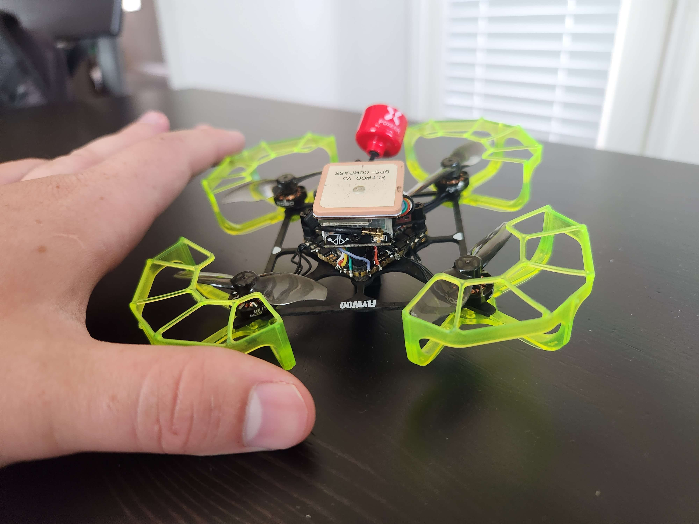

# IQ Arduwhoop

This project holds parameters, scripts and other information about my arduwhoop build. The goal of this project was to make a whoop drone that was capable of running Ardupilot. This drone consists of the flywoo GN745 AIO ESC FC board with the GM8 GPS and the MRO SIK telemetry radio. The drone is powered by a 2s 420mah battery. The total weight of the drone with battery is 76g. If you would like to build your own, the parts list can be found at the link below. 

https://docs.google.com/spreadsheets/d/1IXLM4TMvut4r6jN9-gEEboaGNLur6-ZLpiZj0F0QWQA/edit?usp=sharing

## Setup

### Flashing the firmware

I followed this guide to flash the firmware onto the FC the first time since the gn745 does not come with ardupilot preinstalled so you won't be able to flash it with mission planner the first time. 

https://ardupilot.org/copter/docs/common-loading-firmware-onto-chibios-only-boards.html#download-driver-and-flashing-tool

### Configuring the firmware 

## Links 

gn745 ardupilot docs
- https://ardupilot.org/copter/docs/common-flywoo-f745.html