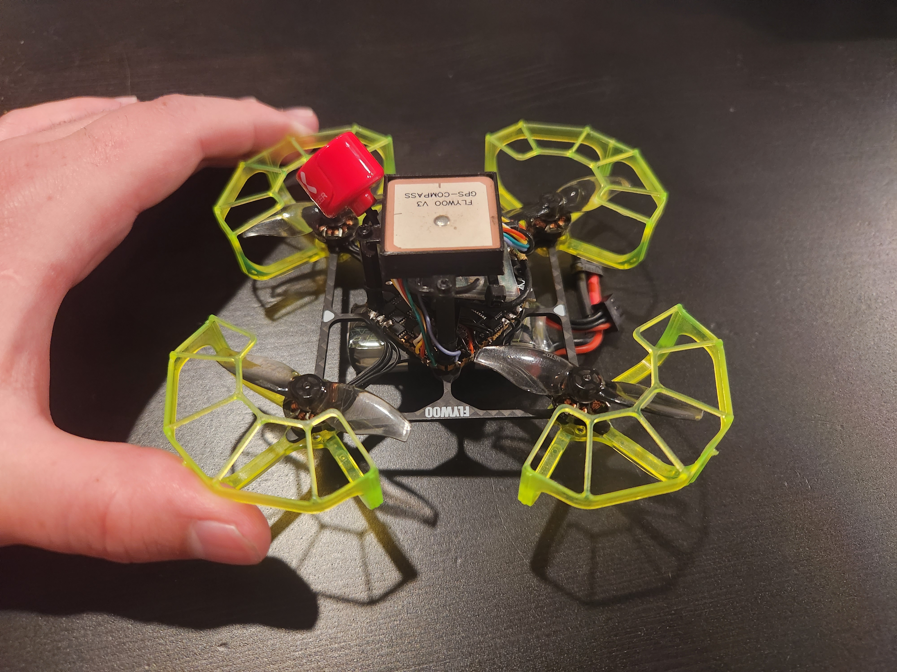
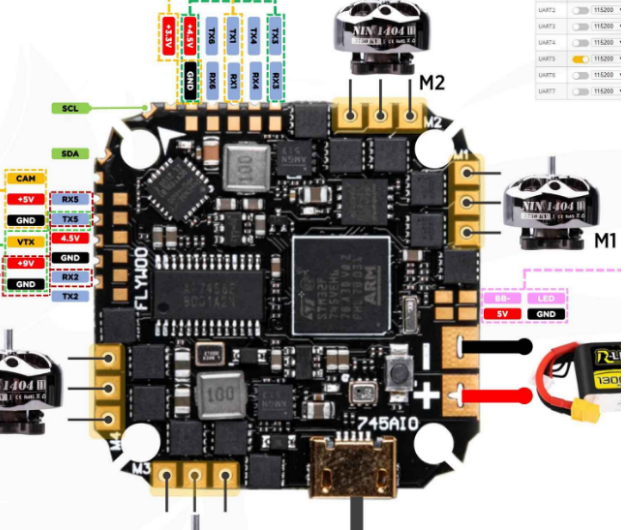
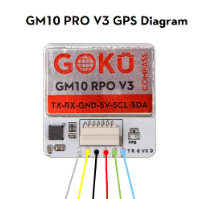
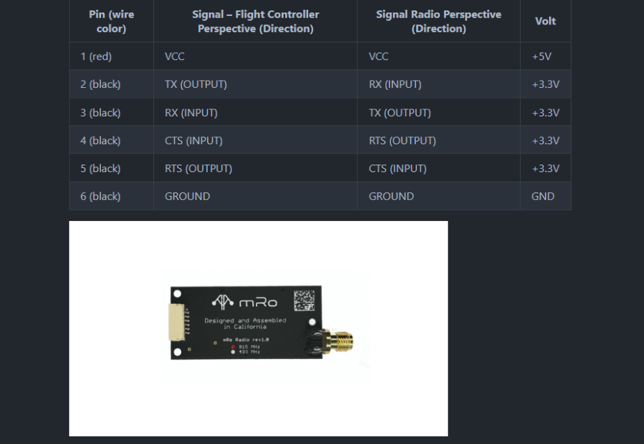

# IQ Arduwhoop

This project holds parameters, scripts and other information about my arduwhoop build. The goal of this project was to make a tiny whoop drone that was capable of running Ardupilot. This drone consists of the flywoo GN745 AIO ESC FC board with the GM8 GPS and the MRO SIK telemetry radio. The drone is powered by a 2s 420mah battery. The total weight of the drone with battery is 76g. If you would like to build your own, the parts list can be found at the link below. 

https://docs.google.com/spreadsheets/d/1IXLM4TMvut4r6jN9-gEEboaGNLur6-ZLpiZj0F0QWQA/edit?usp=sharing

## 3D Printed Parts

The 3D printed parts for this drone can be found in the `stls` folder. 

## Wiring 

GN745

### GPS 
| GPS |  FC  |
|-----|------|
| T   | RX6  |
| R   | TX6  |
| G   | Gnd  |
| V   | 4.5V |
| C   | SCL  |
| D   | SDA  |

### Telemetry Radio

| RADIO |  FC  |
|-------|------|
| VCC   | 4.5V |
| RX    | TX5  |
| TX    | RX5  |
| RTS   | RX2  |
| CTS   | TX2  |
| GND   | GND  |

## Firmware Setup

### Flashing the firmware

I followed this guide to flash the firmware onto the FC the first time since the gn745 does not come with ardupilot preinstalled so you won't be able to flash it with mission planner the first time. 

https://ardupilot.org/copter/docs/common-loading-firmware-onto-chibios-only-boards.html#download-driver-and-flashing-tool

### Configuring the firmware 

Upload the Parameter file `params/arduwhoop_tune_no_calibration.params`. To see an explaination of the parameters, see [this section](#parameter-explanation) below.

Be sure to do the following calibrations before flying.

- Gyro
- accelerometer
- compass
- ESC calibration

### Motor Spin Direction

More than likely there will be a motor or 2 that will need it's spin direction reversed. You will need to use the blheli configurator to do this. this link describes how to do this.

https://ardupilot.org/copter/docs/common-blheli32-passthru.html#pass-through-support

## Parameter Explanation

- ATC - Attitude and rate controller gains and parameters
- BATT_FS_CRT_ACT 1 - land when battery is critically low
- BATT_FS_LOW_ACT 2 - RTL when battery is low
- BATT_LOW_VOLT	7.19 - voltage at which battery is considered low
- FRAME_CLASS	1 - quadcopter
- FRAME_TYPE	12 - BetaflightX
- FS_GCS_ENABLE	1 - enable failsafe when GCS is lost
- MOT_SPIN_ARM	0.15 - minimum motor spin speed when armed
- MOT_SPOOL_TIME	1.2 - time to spool up motors when armed
- PILOT_TKOFF_ALT	1 - minimum commandable altitude from GCS
- PSC - position control gains and parameters
- RTL_ALT	600 - altitude to return to when RTL is triggered
- RTL_LOIT_TIME	1000 - time to loiter at RTL_ALT before landing
- SERIAL5_PROTOCOL	2 - mavlink telemetry for sik radio
- servoX_function - motor mapping 
- SERVO_BLH_AUTO 1 - enable blheli passthrough
- WPNAV_SPEED	400 - maximum speed in cm/s
- WPNAV_SPEED_UP	200 - maximum speed in cm/s when ascending

## Links 

gn745 ardupilot docs
- https://ardupilot.org/copter/docs/common-flywoo-f745.html